This week's task is to gain "the empirical understanding of what is going on". I will work on coding my own SAE in a way I can easily tweak and visualize the effects of different parameters. In other words, I will be learning PyTorch - a deep learning framework commonly perceived as more appropriate for research compared to Tensorflow.

I think an important distinction of the common use case of SAE to the one here should be made. Usually, SAE are used to disentangle dense representations (e.g. word embeddings) into more interpretable ones, while here the goal is to learn disentangled and interpretable features directly from the data (MNIST handwritten numbers).

# Initial attempt and tests

To find out how to implement SAE I looked over some tutorials and simply searched for implementations and started with 2 versions:

- Geeks for Geeks - Tensorflow - https://www.geeksforgeeks.org/deep-learning/sparse-autoencoders-in-deep-learning/
- ChatGPT implementation - Pytorch (you can find in my gh)

What I immediately noticed was the loss calculation.

```python
def sparse_loss(y_true, y_pred):
    mse_loss = tf.reduce_mean(keras.losses.MeanSquaredError()(y_true, y_pred))
    hidden_layer_output = encoder(y_true)
    mean_activation = tf.reduce_mean(hidden_layer_output, axis=0)

    kl_divergence = tf.reduce_sum(sparsity_level * tf.math.log(sparsity_level / (mean_activation + 1e-10)) +
                                  (1 - sparsity_level) * tf.math.log((1 - sparsity_level) / (1 - mean_activation + 1e-10)))

    return mse_loss + lambda_sparse * kl_divergence
```

For the sparsity they use the kl_divergence Kullback–Leibler divergence $D_{KL} = \sum \left( \rho \log \frac{\rho}{\hat{\rho} + \epsilon} + (1 - \rho) \log \frac{1 - \rho}{1 - \hat{\rho} + \epsilon} \right)$ [wikipedia](https://en.wikipedia.org/wiki/Kullback%E2%80%93Leibler_divergence). When put in the loss function it instead of forcing sparsity (small number of non-zero activations) it rather penalizes the model for not having the average activation close to the desired sparsity level. This is a bit counter-intuitive, but seems to be common approach.

Visualization of the encoder/decoder weights after training:
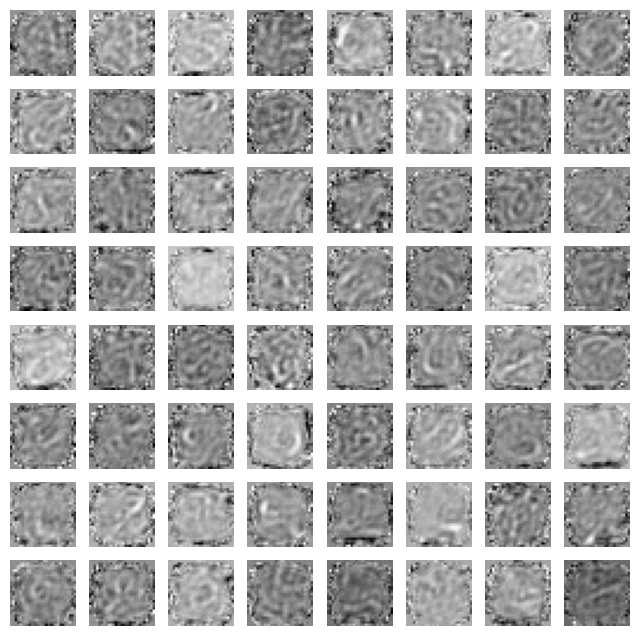
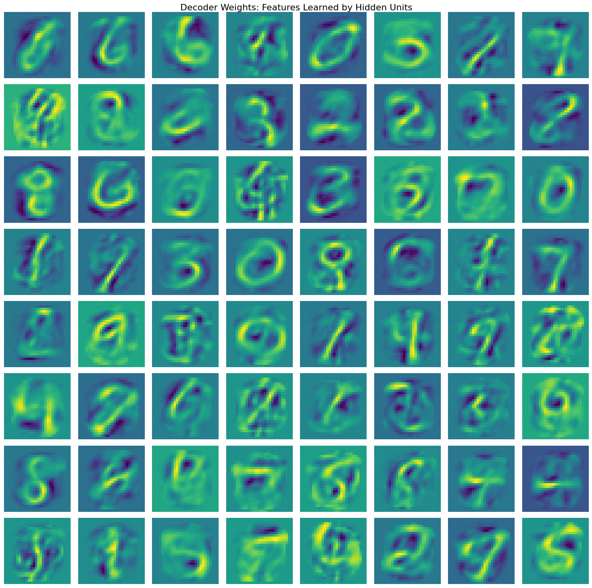
Where the decoder weights do show some interpretable patterns, the encoder weights on the other hand are quite noisy.

But importantly, since the implementation forces the mean to be low, there are many active hidden units and the actual sparsity is pretty low:
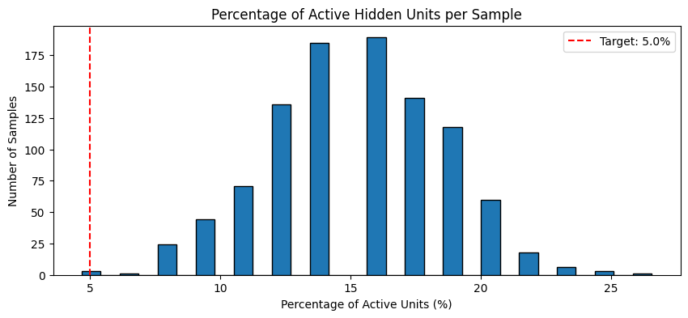

# My own implementation

As mentioned before, I decided to implement my own SAE in PyTorch. Deciding on the definition of the training objective I went to the paper from my last [post](https://www.maksderylo.com/#/blog/30-09-2025-ml-research-1) - **Disentangling Dense Embeddings with Sparse Autoencoders - Charles O'Neill, Christine Ye, Kartheik Iyer, John F. Wu**, where they use $k$-sparse constraint.

## Conceptual Inconsistency in the Paper?

Quoting the paper:
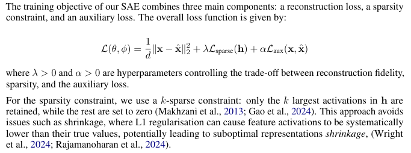

I believe there is a conceptual inconsistency here. Using the $k$-sparse constraint should not be in the loss function, as it is a hard constraint. Instead of penalizing activation of non k-largest activations, the smaller ones are zeroed out, thus the lambda variable seems useless.

> Note: After further investigation, the original paper this one cites indeeds clarifies this inconsistency like so:
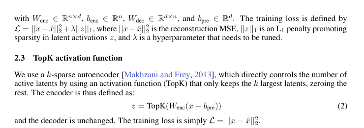 where it correctly distinguishes between TopK and L1 sparse autoencoders. 

## Implementation 

Moving forward, for now I disregard the auxiliary loss and implement the forward pass like so:

``` python 
    def forward(self, x):

        # Encoder: linear projection
        h_pre = self.encoder(x)

        # Apply ReLU to ensure non-negative activations
        h_pre = F.relu(h_pre)

        # TopK activation: keep only k largest activations per sample
        topk_vals, topk_idx = torch.topk(h_pre, self.k_param, dim=1)

        # Create sparse activation tensor
        h = torch.zeros_like(h_pre)
        h.scatter_(1, topk_idx, topk_vals)

        # Decoder: reconstruct input
        x_hat = self.decoder(h)

        return h, x_hat
```
https://docs.pytorch.org/docs/stable/generated/torch.nn.Module.html
https://docs.pytorch.org/docs/stable/generated/torch.nn.Sequential.html

and the loss calculation is a simple MSE.

## Results

I decided to train with different values of k 10 and for comparison 64 features, while keeping other parameters constant:

```python
learning_rate=0.0005,
num_epochs=50,
batch_size=256,
hidden_size=64,
```

### k=10
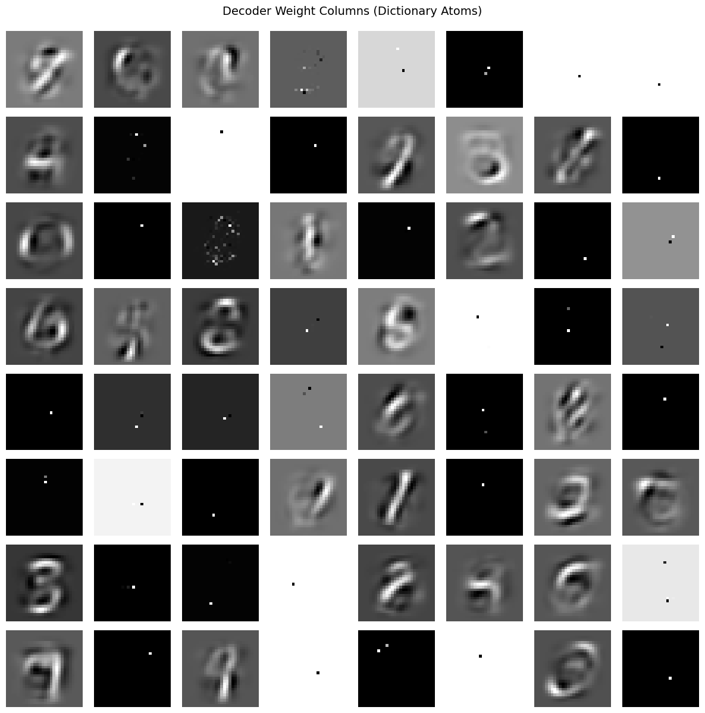
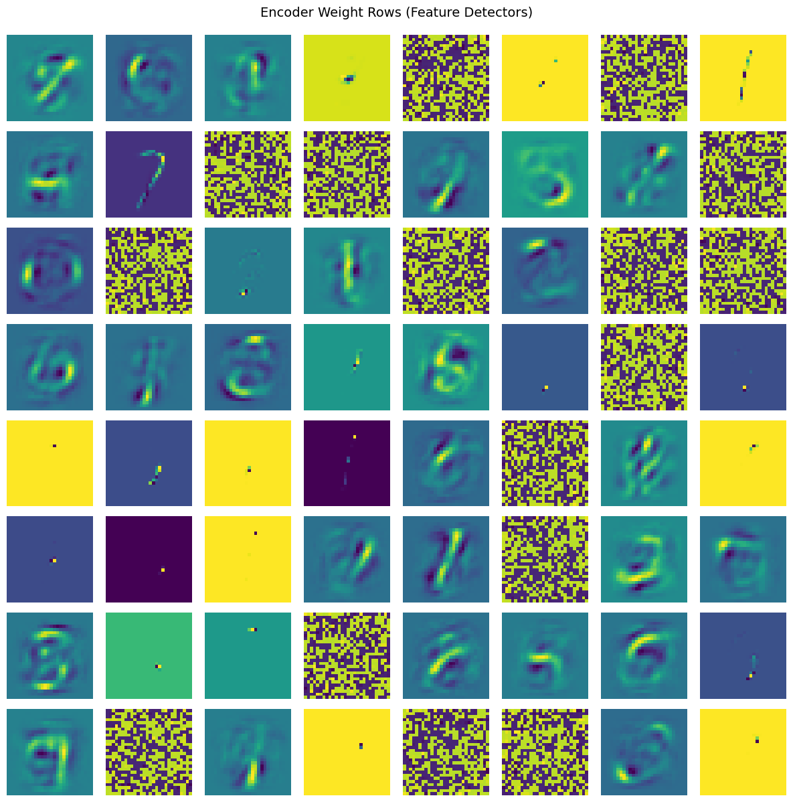

What shows quickly is the large number of dead features (>50%), but these encoder decoder weights show clear distinguishable patterns. Then each reconstruction is made with at most 10 features, which is quite impressive.
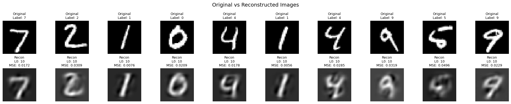


The main takeaway is that the model is not utilizing the full potential of available features, but the ones utilized are humanly interpretable.

### k=64

To compare, I trained the same model with k=64, which means no sparsity constraint at all. The results are quite different, for example the encoder weights look like so:
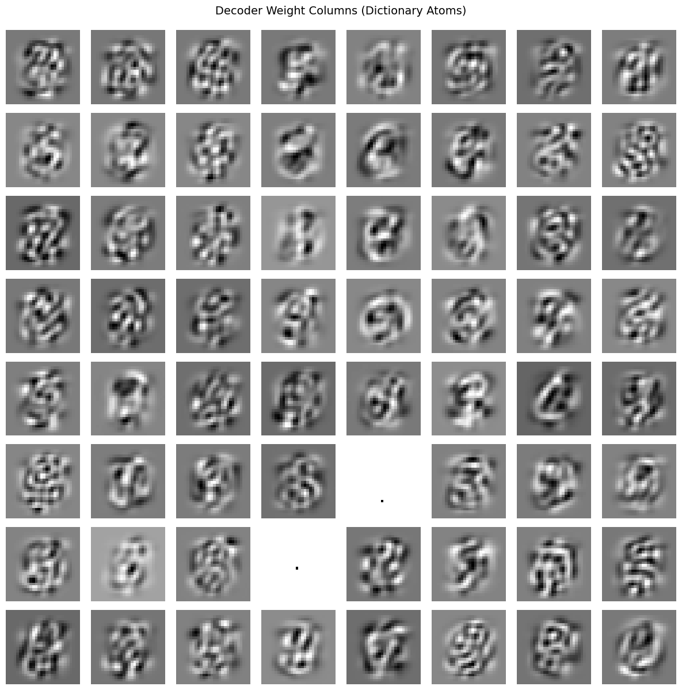
Which again contains dead features (2 in this case), but the rest of the features are not humanly interpretable.
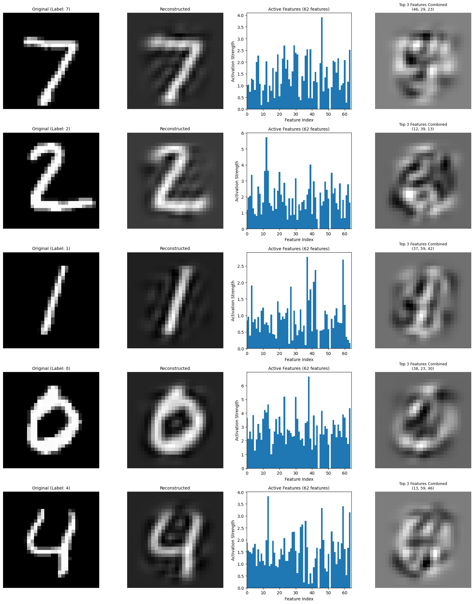
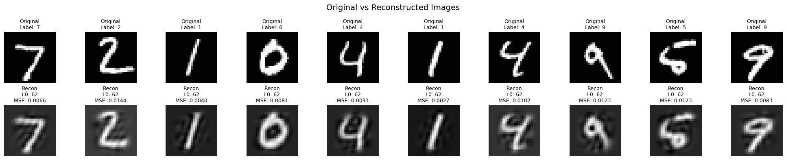
On the other hand, what one might have expected, when the model is less constrained, the reconstructions are better.

## Smaller latent space?

With the large amount of dead features, I wondered if the model would perform similarly given that the latent space is smaller. Repeating the experiment with k=10, about 50% of features were dead, thus I trained the model with hidden size of 32 and k=10. The results are quite similar to the previous k=10 experiment, but now only 9 features are dead.
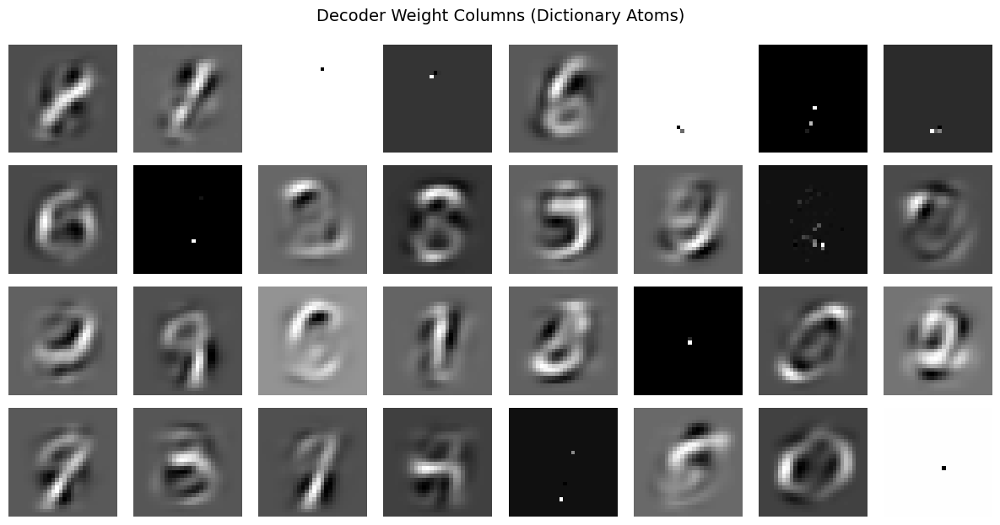
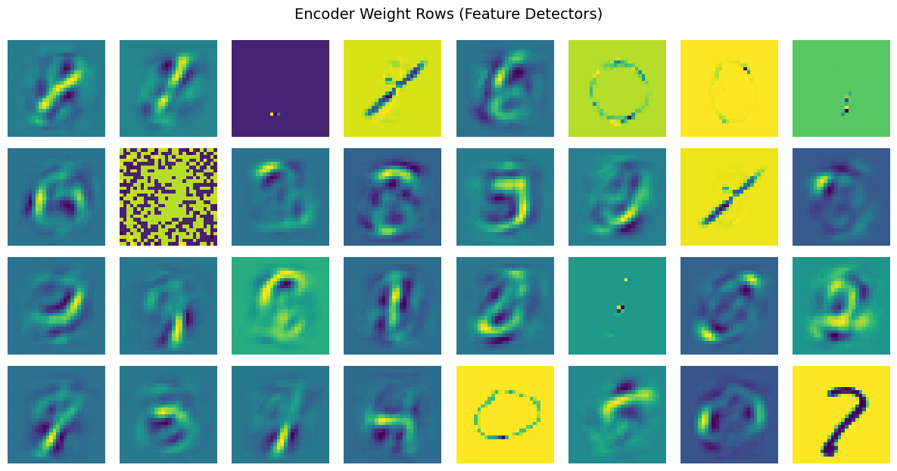
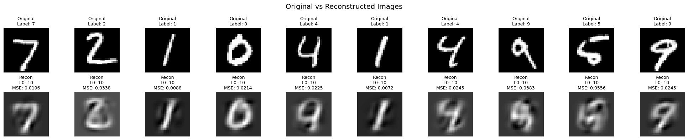

It shows the reconstructions got worse although the amount of active features didn't drop drastically (23 active vs 30 active previously). Going even further down e.g. latent space = 15, the number of dead features seems to go to zero, but the reconstructions are visibly worse.

# Going further

I think the next steps would be:
- Tackle dead features - learn the usage of auxiliary loss, initialization of encoder and decoder from the paper or other methods.
- Try different datasets and modality - e.g. faces, text embeddings.
  

https://cdn.openai.com/papers/sparse-autoencoders.pdf
https://openai.com/index/extracting-concepts-from-gpt-4/