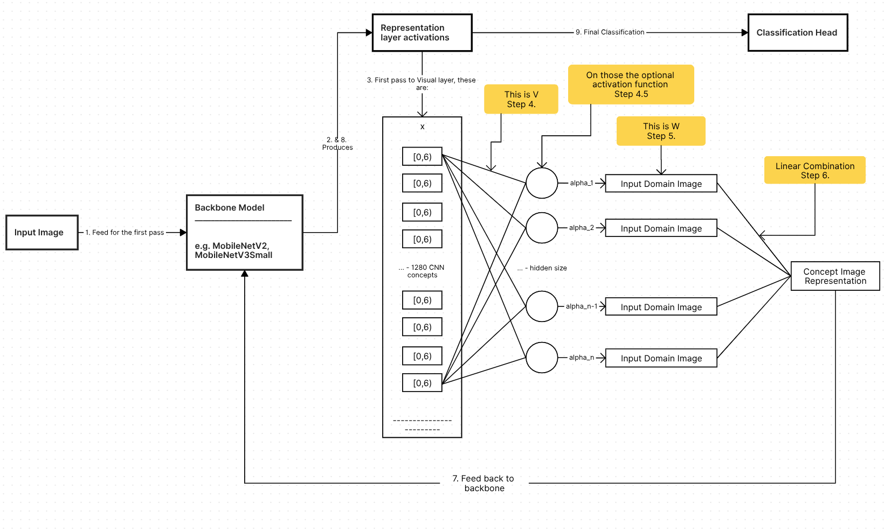
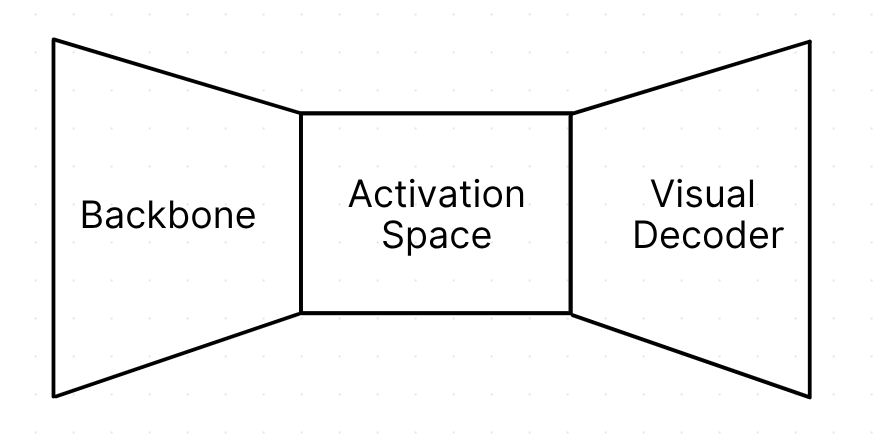
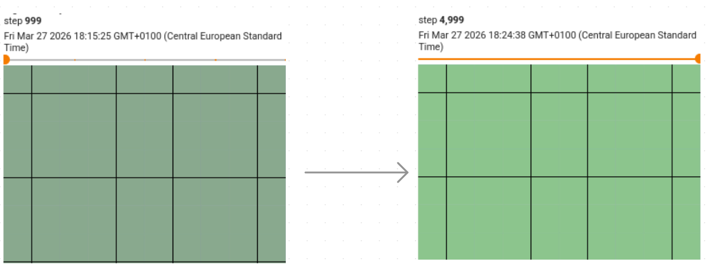
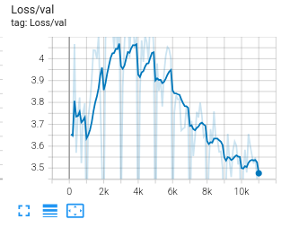
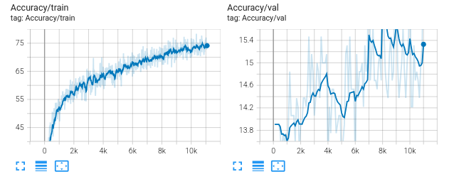
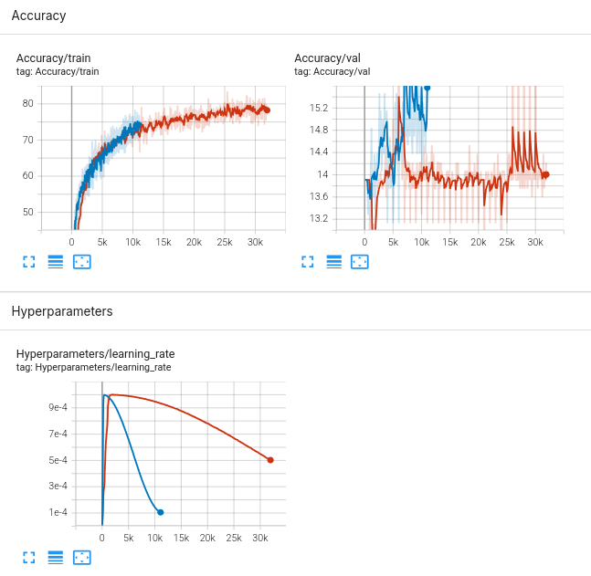

This post builds on the [last weeks architecture](https://maksderylo.com/#/blog/18-03-2026-bep-research-1). 

# Initial architecture
The optimization I attempted was:

$$
\min_{V, W, g} \frac{1}{N} \sum_{j=1}^N \mathcal{L}_{CE}(g(\omega (W^T \sigma(V^T \omega(x^{(j)})))), y^{(j)})
$$

To visualize what was happening:


## Critique
For the sake of interpretability contains some major issues. In this formulation **all** the training parameters go against what we want to achieve:
1. Using $V\in \mathbb{R}^{m\times n}$ (representation layer to "neuron") has some pros and cons. It allows for the model to learn linear combinations from the representation layer which could already partially address "concept entanglement" idea. On the other hand, we are interested to see what each representation layer neuron represents itself.
2. Ok, $W \in \mathcal{R}^{n\times l}$ (the neuron attached images) are fine for now, we'll address those later.
3. The classifier $g$ being part of optimization makes the model optimize for the out of distribution linear combinations it receives during the second pass through the backbone model. That way the classification task adapts to the new architecture instead of allowing us to understand the backbone model concepts.

# Moving on to this week

All of these were simple fixes, but had their own implications. Removing the intermediate linear layer meant we'd have to attach an input domain image to the entire size of the representation layer from the backbone model. Given that mobilenet activation vector is of size 1280 it was infeasible to train such a network. Even after moving to MobileNetV3Small with less than half the size the model had ~87 M params.

Many attempts happened since that change, but in a nutshell the model was **just learning the training data** using adversarial perturbations. With such a huge model size, there was no gradient flow to the pixels.

## Decoder Idea
Instead, we look at the activations generated for an image as "conceptual compression", and use a convolutional decoder to extract the visual representations.


With the implementation being:
```python
self.visual_decoder = nn.Sequential(
    nn.Conv2d(concept_dim, concept_dim, 3, padding=1, groups=concept_dim),
    nn.ReLU(inplace=True),
    nn.Upsample(scale_factor=2, mode="bilinear", align_corners=False),  # 7 -> 14

    nn.Conv2d(concept_dim, concept_dim, 3, padding=1, groups=concept_dim),
    nn.ReLU(inplace=True),
    nn.Upsample(scale_factor=2, mode="bilinear", align_corners=False),  # 14 -> 28

    nn.Conv2d(concept_dim, concept_dim, 3, padding=1, groups=concept_dim),
    nn.ReLU(inplace=True),
    nn.Upsample(scale_factor=2, mode="bilinear", align_corners=False),  # 28 -> 56

    nn.Conv2d(concept_dim, concept_dim, 3, padding=1, groups=concept_dim),
    nn.ReLU(inplace=True),
    nn.Upsample(scale_factor=2, mode="bilinear", align_corners=False),  # 56 -> 112

    nn.Conv2d(concept_dim, concept_dim, 3, padding=1, groups=concept_dim),
    nn.ReLU(inplace=True),
    nn.Upsample(scale_factor=2, mode="bilinear", align_corners=False),  # 112 -> 224
    
    # Final depthwise conv outputs 3 RGB channels directly
    nn.Conv2d(concept_dim, 3, 3, padding=1, groups=1),
    nn.Sigmoid(),
)
```
I built the decoder not to mix the concepts so they can be visualized independently (same as not using the neural layer from activation). By setting `groups=concept_dim` the concepts don't mix with each other. It's a 5-stage upsample making the output of the decoder same as the input image resolution.

Although each channel of the decoder is not mixing with each other, I found the simple visualization of when one channel for a concept is active while zeroing the rest out (one-hot probes) pretty meaningless - I was getting just the same color for each channel marginally changing throughout the training:

(Though do note, the validation of the model is still just random guessing at this point)

The visualizations are constant without any spatial features by construction, as the input was spatially flat, which yielded with the depthwise convolution:

$$out_k[x,y] = \sum_{dx,dy}W_k[dx,dy] \cdot 1.0 = \text{sum}(W_k) = const$$

And another problem is that the decoder never learns these one-hot probes since the output of the visualization layer is a dense vector making it an OOD problem. With that, we change the `visualize_concept` method to use a precomputed `mean_activation` - the average feature map over the training images for a baseline. Then for a concept `k`:
1. **Img High** - Take the mean activation, add a constant `delta` to the channel `k` $\to$ decode $to$ get RGB image.
2. **Img Low** - Take the mean activation, subtract a constant `delta` to the channel `k` $\to$ decode $to$ get RGB image.
3. Take the difference of `img_high` and 'img_low' and normalize.
The idea being, that we extract the contribution of a concept to a mean image activations.
```python
@torch.no_grad()
def visualize_concept(self, k, mean_activation, delta=3.0, device="cuda"):
    """
    Visualize neuron k by perturbing it around the mean activation.
    Uses realistic background (mean activation) instead of one-hot input.
    
    Args:
        k: Neuron index to visualize
        mean_activation: Precomputed mean activation map [1, feature_dim, 7, 7]
        delta: Amount to perturb the neuron (default: 3.0)
        device: Device to run on
        
    Returns:
        diff: Visualization showing neuron k's contribution [1, 3, 224, 224]
    """
    assert 0 <= k < self.feature_dim
    base = mean_activation.clone().to(device)
    
    # Perturb neuron k upward
    high = base.clone()
    high[0, k, :, :] += delta
    img_high = self.visual_decoder(high)  # Direct RGB output
    
    # Perturb neuron k downward
    low = base.clone()
    low[0, k, :, :] -= delta
    img_low = self.visual_decoder(low)  # Direct RGB output
    
    # Difference shows neuron k's visual contribution
    diff = img_high - img_low
    
    # Normalize to [0,1] for display
    diff = (diff - diff.min()) / (diff.max() - diff.min() + 1e-8)
    
    return diff.cpu()
```

## Losses
In a nutshell, we are still dealing with extreme overfitting problem, adversarial perturbations and lack of signal to differentiate between concepts. Thus, I extend the loss with:
1. **Feature Reconstruction** - by default the decoder doesn't have to learn the real input space domain images. To combat that, we would like for the concept reconstructions by the decoder to produce images yielding similar feature reconstructions by the backbone model.

$\mathcal{L}_{\text{feat recon}} = \frac{1}{C \cdot H \cdot W} \sum_{c=1}^{C} \sum_{h=1}^{H} \sum_{w=1}^{W} \left( f(x)_{c,h,w} - f(\hat{x})_{c,h,w} \right)^2$
where $f(\cdot) \in \mathbb{R}^{C \times H \times W}$ is the backbone spatial feature extractor (here $C=576,\ H=W=7$), $x$ is the input image, and $\hat{x}$ is the decoder's reconstruction.
and the code is:
```python
# Spatial reconstruction — much stronger constraint
original_spatial = model.features(x_aug)  # [B, 576, 7, 7]
reconstructed_spatial = model.features(generated_images)  # [B, 576, 7, 7]

# Reconstruction loss: generated image must re-encode to same spatial activation pattern
feature_loss = F.mse_loss(reconstructed_spatial, original_spatial.detach())
feature_loss_value = feature_loss.item()

# Decay feature reconstruction weight over training (start high, end low)
feature_recon_weight = FEATURE_RECON_WEIGHT * (1.0 - 0.8 * progress)  # 5.0 -> 1.0
total_loss = total_loss + feature_recon_weight * feature_loss
```

2. **Isolation Loss** - additionally sometimes, we would like to push the concepts to be visually different. To achieve that, we sample the concepts closest to each other(hard-mining) and let the image be decoded from the one hot concept map:

$\mathcal{L}_{\text{isolation}} = \frac{1}{|\mathcal{H}|} \sum_{(i,j) \in \mathcal{H}} \cos\!\left(\hat{x}_i,\, \hat{x}_j\right)$

Now I realize this loss in this state might be flawed. It still operates on one-hot activations, however those don't represent the contribution of a concept and it should be moved to the mean spatial activation map impact. Code being:
```python
def compute_isolation_loss(self, num_concepts, device="cuda"):
    """
    Compute isolation regularization loss using hard negative mining.
    Samples concepts in batches, finds the most similar pairs, and pushes those apart.
    Operates on final RGB output directly from decoder.
    
    Args:
        num_concepts: Number of concepts to sample and compare
        device: Device to run on
        
    Returns:
        isolation_loss: Scalar tensor representing average similarity of sampled pairs
    """
    # Sample random concept indices (can't decode all 576 due to memory)
    sampled_indices = torch.randperm(self.feature_dim, device=device)[:num_concepts]
    
    # Create one-hot concept maps for sampled concepts
    concept_maps = torch.zeros(num_concepts, self.feature_dim, 7, 7, device=device)
    for i, idx in enumerate(sampled_indices):
        concept_maps[i, idx, :, :] = 1.0
    
    # Decode concepts to RGB images directly
    rgb_images = self.visual_decoder(concept_maps)  # [num_concepts, 3, 224, 224]
    
    # Flatten RGB images to vectors
    feature_vectors = rgb_images.flatten(1)  # [num_concepts, 3*224*224]
    feature_vectors = F.normalize(feature_vectors, p=2, dim=1)
    
    # Compute pairwise cosine similarity matrix
    similarity_matrix = torch.mm(feature_vectors, feature_vectors.t())  # [num_concepts, num_concepts]
    
    # Hard negative mining: find top-k most similar pairs from sampled concepts
    # Flatten upper triangle to avoid counting pairs twice
    triu_indices = torch.triu_indices(num_concepts, num_concepts, offset=1, device=device)
    triu_similarities = similarity_matrix[triu_indices[0], triu_indices[1]]
    
    # Get hardest pairs (most similar) - focus on top 25%
    num_hard = max(1, len(triu_similarities) // 4)
    hard_similarities, _ = torch.topk(triu_similarities, num_hard)
    
    # Penalize these hard pairs (want to push most similar concepts apart)
    isolation_loss = hard_similarities.mean()
    
    return isolation_loss
```

# Results

## Loss and accuracy
The trainings performed were still quite short, but the validation loss does indeed trend downwards, however it is still significantly higher than the validation:

Same goes for accuracy validation compared to training is still 5 times smaller. It's interesting though, that finally we are noticing upward trends, and it is not taking discrete values of just guessing a single class every time.


Furthermore, this run might have been a fluke and such results do not seem to be consistent. When performing an experiment for a significantly higher amount of steps (30k compared to 10k), the underwhelming results come back.

(maybe this is the issue of parameters and decay?)

## Look at the images
```imageslider
[
  {
    "step": 999,
    "image": "assets/step_999.png"
  },
  {
    "step": 1999,
    "image": "assets/step_1999.png"
  },
  {
    "step": 2999,
    "image": "assets/step_2999.png"
  },
  {
    "step": 3999,
    "image": "assets/step_3999.png"
  },
  {
    "step": 4999,
    "image": "assets/step_4999.png"
  },
  {
    "step": 5999,
    "image": "assets/step_5999.png"
  },
  {
    "step": 6999,
    "image": "assets/step_6999.png"
  },
  {
    "step": 7999,
    "image": "assets/step_7999.png"
  },
  {
    "step": 8999,
    "image": "assets/step_8999.png"
  },
  {
    "step": 9999,
    "image": "assets/step_9999.png"
  },
  {
    "step": 10999,
    "image": "assets/step_10999.png"
  }
]
```

# Related work