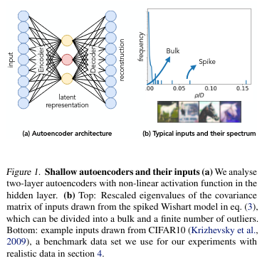
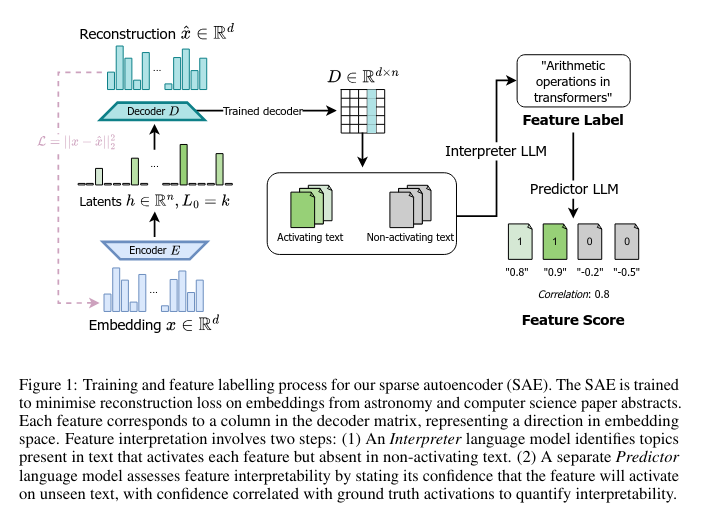
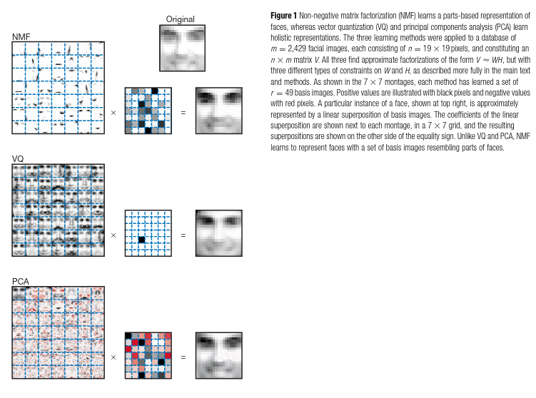
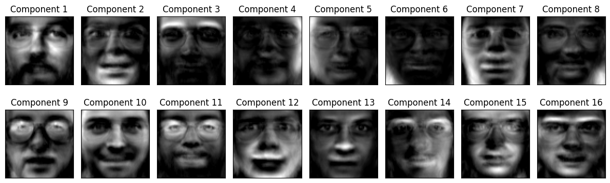
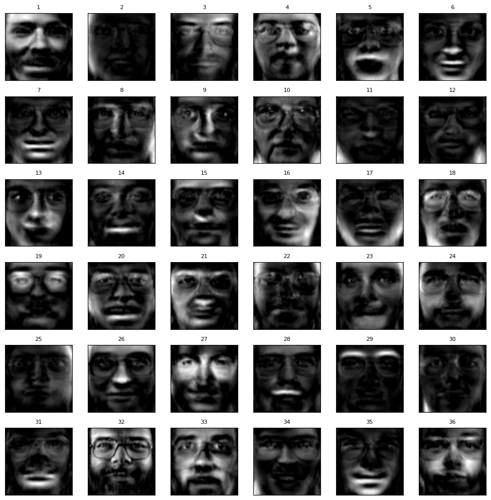
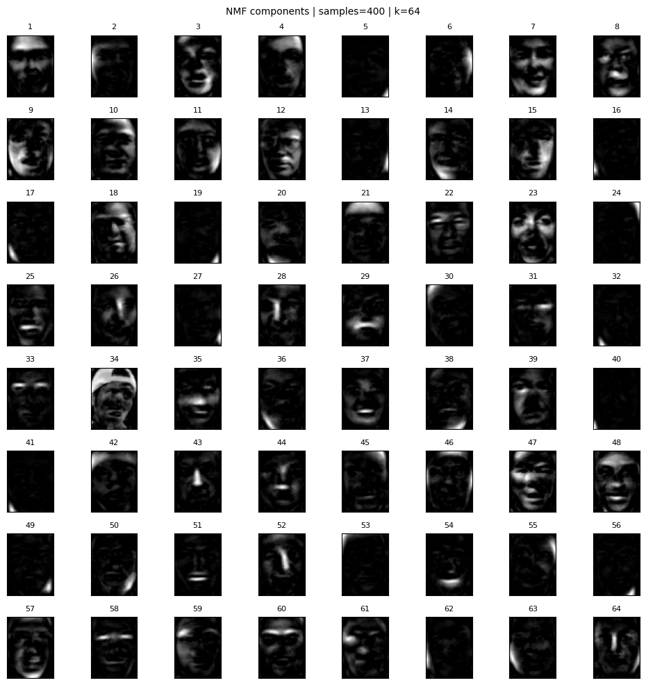
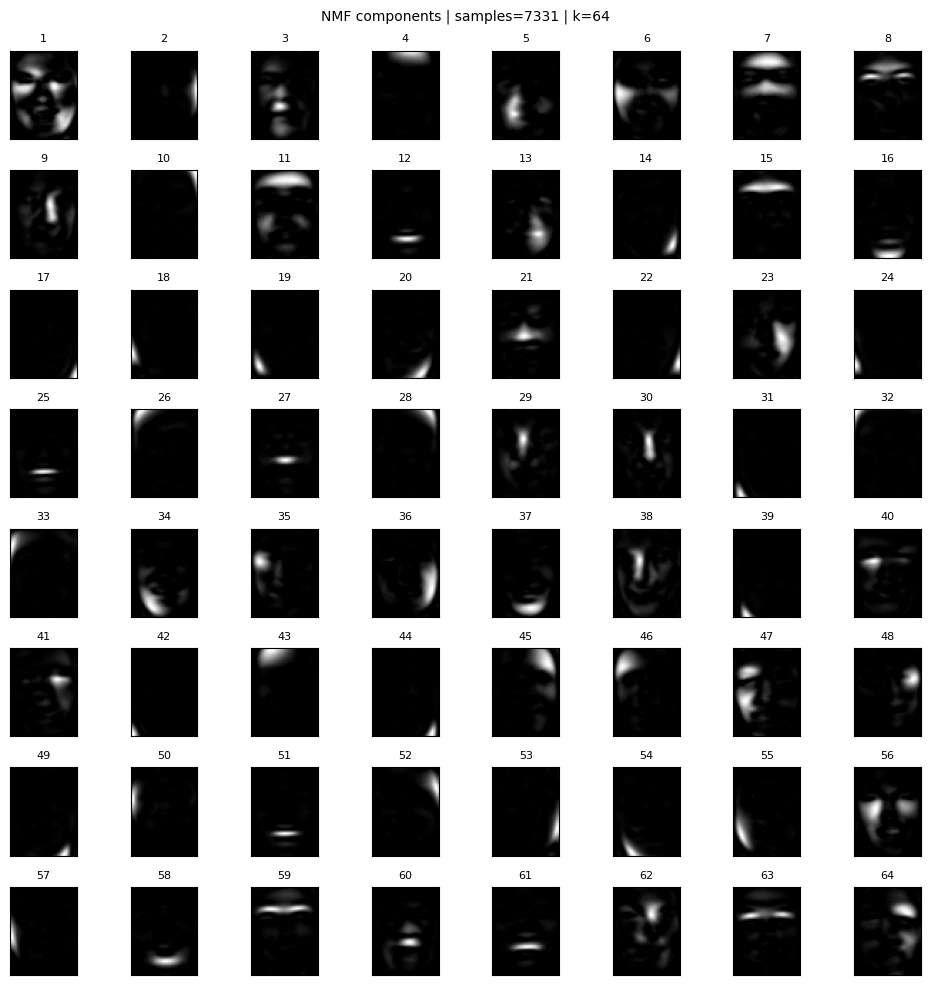

This is the first post in a series where I plan to improve my writing abilities, as well as compile some of the knowledge I gather from reading papers, performing experiments and doing research on various machine learning topics.

# Papers and Notes

## The dynamics of representation learning in shallow, non-linear autoencoders - Maria Refinetti, Sebastian Goldt

https://proceedings.mlr.press/v162/refinetti22a/refinetti22a.pdf

The main question of this paper I take out is the investigation whether nonlinear autoencoders can reach the PCA error, which the linear AE do by learning the principal components sequentially. With that said, as this is a paper that focuses on training of autoencoders, understanding (or at least attempting to) the decisions and the math behind it is a good learning opportunity to get the intuition for my own experiments later.

### Definitions

**Autoencoders (AE)** - class of neural networks trained to reconstruct their inputs.

**Vanilla SGD** - selects only single point/batch of points to estimate the gradient at each step.

**Bottleneck** - usually called the intermediate layer, as it often is significantly smaller than the input dimension. Forces the learning of compressed representation of inputs.

**Shallow AE** - having single hidden layer.

**Tied AE** - where encoder and decoder weights are equal.

**Teacher-Student setup** - smaller model learns to mimic larger pre-trained one.

### Shallow Autoencoder - used in a paper

Given a $D$-dimensional input $\bold{x} = (x_i)$ the output of the autoencoder is given by

$$
\hat{x} = \sum_k^K v_i^k g(\lambda^k)\text{, } \lambda^k\equiv\frac{\bold{w}^k\bold{x}}{\sqrt{D}}
$$

where:

- $\bold{w}^k, \bold{v}^k \in \mathbb{R}^D$ are the encoder and decoder weight of the $k$th hidden neurons respectively.
- $g(\cdot)$ is a function (either linear or non-linear).

Note, this is not a general form, but a mathematical one specific to the paper's investigation.



The performance of a given autoencoder is measured by the **population reconstruction mean-squared error**:

$$
\text{psme} \equiv \frac{1}{D}\sum_i \mathbb{E}(x_i - \hat{x}_i)^2
$$

### Practical Implications

The paper investigates the sequential learning of principal components ir order of eigenvalue magnitude phenomenon. It shows the learning occurs in phases - the alignment phase where weights align to principal component directions, and the rescaling phase, where weight norms adjust to achieve PCA error.

Some critical requirements mentioned are that sigmoidal AE with tied weights fail to achieve PCA error, and ReLU autoencoders require trainable biases to perform well. It is a readers (also mine) task to investigate why.

Furthermore, the research notes the result hold remarkably well on real datasets like (CIFAR-10), as the derived models use synthetic Gaussian data.

## Disentangling Dense Embeddings with Sparse Autoencoders - Charles O'Neill, Christine Ye, Kartheik Iyer, John F. Wu

https://arxiv.org/abs/2408.00657

This is my starting point with Sparse Autoencoders, both delving deeper mathematically, and learning the practical application of disentangling features. Specifically, due to operations on relatively small latent spaces, activations of neurons are tangled leading to the "everything activates everything" problem. Using sparse AE, having larger latent space than the input and output, as well as adding sparsity to the objective, allow to retrieve the meaning behind encoded features.



This paper aims to fill the gap by analyzing the application of SAE to dense text embeddings developing a model for interoperability, (or as above - autointerpretability - which I less focus on) of features and relationships between them. Importantly, it provides background on embedding representation and sparse autoencoders, thus .

## Definitions

**Sparse autoencoder (SAE)** - class of autoencoders with a sparse set of features (semantic concepts) in a higher-dimensional space, potentially disentangling superposed features.

**One-hot encodings** - vectors with a single 1 for category and 0 for the rest - equidistant.

**Dense vector embedding** - continuous, low-dimensional vectors.

**Ablation** - systematic removal or modification of a component (such as a layer, feature, or module) in a model to evaluate its impact on overall performance.

### Sparse Autoencoders

Let $\bold{x} \in \mathbb{R}^d$ be an input vector, and $\bold{h} \in \mathbb{R}^n$ be the hidden representation, where typically $n \gg d$ (much greater than). The encoder and decodder functions are defined as:

$$
\begin{aligned}
\text{Encoder: }\quad \bold{h} &= f_\theta(\bold{x}) = \sigma(W_e \bold{x} + \bold{b}_e) \\
\text{Decoder: }\quad \hat{\bold{x}} &= g_\phi(\bold{h}) = W_d \bold{h} + \bold{b}_d
\end{aligned}
$$

where $W_e \in \mathbb{R}^{n \times d}$ and $W_d \in \mathbb{R}^{d \times n}$ are encoding and decoding weight matrices and their corresponding bias vectors $b_e \in \mathbb{R}^n$ and $b_d \in \mathbb{R}^d$, $\sigma(\cdot)$ is a non-linear activation function (like ReLU or sigmoid).

The training objective of SAE combines three components:

- Reconstruction loss
- Sparsity constraint
- Sometimes (here) auxiliary loss

$$
\mathcal{L}(\theta,\phi) = \frac{1}{d} \Vert \bold{x-\hat{x}} \Vert_2^2 + \lambda \mathcal{L}_{sparse}(h) + \alpha \mathcal{L}_{aux}(x,\hat{x})
$$

where $\lambda > 0$ and $\alpha > 0$ are hyperparameters controlling the trade-off between reconstruction fidelity, sparsity, and the auxiliary loss.

As the sparsity constraint, they use a $k$-sparse constraint - only $k$ largest activations in $\bold{h}$ are retained.

As the auxiliary loss, they use a technique to remove non activating "dead" latents. Latents are flagged as dead during training if they have not activated for a predetermined number of tokens. Given the reconstruction error of the main model $\bold{e = x -\hat{x}}$, they define the auxiliary loss as:

$$
\mathcal{L}_{aux}(\bold{x,\hat{x}}) = \Vert \bold{e - \hat{e}} \Vert_2^2
$$

where $\bold{\hat{e}} =W_d\bold{z}$ is the reconstruction using the top $k_{aux} = 2k$ (twice the number of active latents) dead latents, and $\bold{z}$ is the sparse representation using only these dead latents. This additional loss term helps to revive dead features and improve overall representational capacity of the model.

## Learning the parts of object by non-negative matrix factorization - Daniel D. Lee, H. Sebastian Seung

https://www.cs.columbia.edu/~blei/fogm/2020F/readings/LeeSeung1999.pdf

In this paper researchers introduce Non-negative Matrix Factorization (NMF) as a method to learn parts-based representation of data. Unlike traditional methods like PCA or vector quantization, which often produce holistic representations, NMF yields a decomposition where both the basis components and the coefficients are non-negative, leading to more interpretable parts-based representations.
With that, it is an inspiration for my own experiments with NMF, as well as a good starting point for understanding the method and its applications.

### Definitions

**Non-negative Matrix Factorization (NMF)** - a group of algorithms in multivariate analysis and linear algebra where a matrix $V$ is factorized into (usually) two matrices $W$ and $H$, with the property that all three matrices have no negative elements. This non-negativity makes the resulting matrices easier to inspect.
**Holistic representation** - a representation where each component captures global features of the data, often leading to entangled and less interpretable features.
**VQ** - vector quantization.
**PCA** - principal component analysis.

### NMF, VQ and PCA formulations

Given a non-negative data matrix $V$ of dimensions $n \times m$, NMF seeks to find two non-negative matrices $W$ (of dimensions $m \times r$) and $H$ (of dimensions $r \times n$) such that:

$$
V \approx WH
$$

$$
V_{i\mu} \approx \sum_{a=1}^r W_{ia}H_{a\mu}
$$

Where in the case of image data, $V_{i\mu}$ represents the intensity of pixel $i$ in image $\mu$, $W_{ia}$ represents the contribution of pixel $i$ to feature $a$, and $H_{a\mu}$ represents the activation of feature $a$ in image $\mu$.
The $r$ columns of $W$ are called basis images. Each column of $H$ is called an encoding and is one-to-one correspondence with a face in $V$.
The dimensions of the matrices $W$ and $H$, that are $n\times r$ and $r\times m$, respectively, are chosen such that $r < \min(m,n)$, leading to a compressed representation of the data.

The differences between NMF, VQ and PCA are due to different constrains imposed on $W$ and $H$:

- **VQ** - constrains $H$ to be a binary matrix with exactly one non-zero entry per column(unary vectors), and $W$. This means each data point is represented by a single basis vector.
- **PCA** - allows both positive and negative entries in $W$ and $H$, leading to holistic representations where each basis vector can contribute positively or negatively to the reconstruction of data points.
- **NMF** - constrains both $W$ and $H$ to be non-negative, leading to parts-based representations where basis vectors represent additive components of the data.
  

### Repeating the NMF experiment

After reading the paper, I performed a few experiments trying to repeat the experiments with my own code:

```python
import numpy as np
import matplotlib.pyplot as plt
from sklearn.datasets import fetch_olivetti_faces
from sklearn.decomposition import NMF

# 1. Load the Olivetti faces dataset

faces = fetch_olivetti_faces(shuffle=True, random_state=42)
X = faces.data
image_shape = faces.images[0].shape

# 2. Apply NMF

n_components = 16
nmf = NMF(n_components=n_components, init='random', random_state=42, max_iter=10000)
W = nmf.fit_transform(X)
H = nmf.components_

# 3. Visualize the NMF components (parts-based representation)

fig, axes = plt.subplots(2, n_components // 2, figsize=(12, 4),
subplot_kw={'xticks':[], 'yticks':[]})
for i, ax in enumerate(axes.flat):
ax.imshow(H[i].reshape(image_shape), cmap='gray')
ax.set_title(f'Component {i+1}')
plt.tight_layout()
plt.show()
```

This code loads the Olivetti faces dataset, applies NMF to extract 16 components, and visualizes these components as images. I expected the resulting components should represent parts of faces, such as eyes, noses, and mouths, similar to the results presented in the paper.

### Initial experiment

The result was:


This doesn't confirm the results from the paper, as the components are clear faces, not parts of faces. The initial possible reasons for this discrepancy could be:

- Different initialization method for NMF.
- Different number of components.
- Smaller dataset used.
  Or the combination of these factors.

### Addressing the potential issues

To address these issues, I made the following adjustments:

1. Changed the number of components to 36.
2. Changed the initialization method to 'nndsvda', which is known to yield better results for NMF.

```python
n_components = 36
nmf = NMF(n_components=n_components, init='nndsvda', random_state=42, max_iter=10000)
W = nmf.fit_transform(X)
H = nmf.components_

fig, axes = plt.subplots(6, 6, figsize=(10, 10),
                         subplot_kw={'xticks':[], 'yticks':[]})
for i, ax in enumerate(axes.flat):
    ax.imshow(H[i].reshape(image_shape), cmap='gray')
    ax.set_title(f'{i+1}', fontsize=8)
plt.tight_layout()
plt.show()
```

The updated result was:

Which is closer to the expected parts-based representation, showing distinct facial features in some of the components.

The last change was the size of the dataset. The Olivetti dataset contains only 400 images, which might be insufficient for NMF to learn meaningful parts, compared to 2,429 faces used in the paper. To address this, I switched to the LFW (Labeled Faces in the Wild) dataset, which contains over 7,000 images of faces.

With that, I prepared the experiment comparing the convergence of NMF as the number of training samples increased, to see whether the data size/feature to data size did play a role in extracting more specific features.

```python
# python
import numpy as np
import matplotlib.pyplot as plt
from sklearn.decomposition import NMF

def visualize_components_by_size(
    X_train, image_shape, sample_sizes, n_components=64,
    max_iter=1000, random_state=0
):
    assert np.prod(image_shape) == X_train.shape[1], "image_shape does not match feature dimension."
    assert n_components == 64, "For an 8x8 grid, set n_components=64."

    rng = np.random.RandomState(123)

    for size in sorted(s for s in sample_sizes if s > 0):
        size = min(size, len(X_train))
        idx = rng.choice(len(X_train), size=size, replace=False)
        X_sub = X_train[idx]

        nmf = NMF(
            n_components=n_components,
            init='nndsvda',
            random_state=random_state,
            max_iter=max_iter,
            tol=1e-4
        )
        nmf.fit(X_sub)
        H = nmf.components_

        fig, axes = plt.subplots(8, 8, figsize=(10, 10),
                                 subplot_kw={'xticks': [], 'yticks': []})
        for i, ax in enumerate(axes.flat):
            ax.imshow(H[i].reshape(image_shape), cmap='gray')
            ax.set_title(f'{i+1}', fontsize=8)

        fig.suptitle(f'NMF components | samples={size} | k={n_components}', y=0.98, fontsize=10)
        plt.tight_layout()
        plt.show()

# Ensure image_shape matches LFW
image_shape = lfw.images.shape[1:]
assert np.prod(image_shape) == X_train.shape[1]
```

And last thing was to call the function with appropriate parameters:

```python
visualize_components_by_size(
    X_train, image_shape, sample_sizes=[400, len(X_train)],
    n_components=64, max_iter=6000, random_state=0
)
```

Which resulted in:



Finally, I tested the MSE and reconstruction error as the sample size grew, for the number of components 64, as well as increased the maximum number of iterations to 60,000 to ensure convergence.

```python
import numpy as np
import matplotlib.pyplot as plt
from sklearn.datasets import fetch_lfw_people
from sklearn.decomposition import NMF
from sklearn.model_selection import train_test_split

# 1) Load LFW and filter identities with at least 2 images (needed for stratification)
lfw = fetch_lfw_people(min_faces_per_person=0, resize=0.5, color=False)
X = lfw.data.astype(np.float32)
y = lfw.target

counts = np.bincount(y)
keep_labels = np.where(counts >= 2)[0]
mask = np.isin(y, keep_labels)
X, y = X[mask], y[mask]

# 2) Fixed held-out test set (stratified now safe)
X_train, X_test, y_train, y_test = train_test_split(
    X, y, test_size=0.2, random_state=42, stratify=y
)

# 3) Evaluate NMF as training samples increase (unstratified subsampling to avoid per-class count issues)
def eval_nmf(sample_sizes, n_components=64, max_iter=60000, random_state=0):
    rng = np.random.RandomState(random_state)
    results = []
    for size in sorted(s for s in sample_sizes if s > 0):
        size = min(size, len(X_train))
        idx = rng.choice(len(X_train), size=size, replace=False)
        X_sub = X_train[idx]

        nmf = NMF(
            n_components=n_components,
            init='nndsvda',
            random_state=random_state,
            max_iter=max_iter,
            tol=1e-4
        )
        W_train = nmf.fit_transform(X_sub)
        H = nmf.components_

        W_test = nmf.transform(X_test)
        X_test_hat = W_test @ H
        mse = float(np.mean((X_test - X_test_hat) ** 2))
        results.append((size, mse))
        print(f"samples={size} | test MSE={mse:.6f} | train recon_err={nmf.reconstruction_err_:.6f}")
    return results

sample_sizes = [200, 500, 1000, 2000, 4000, 8000, len(X_train)]
results = eval_nmf(sample_sizes, n_components=64, max_iter=60000, random_state=0)

# 4) Plot learning curve
sizes, mses = zip(*results)
plt.figure(figsize=(5, 3))
plt.plot(sizes, mses, marker='o')
plt.xlabel('training samples')
plt.ylabel('test reconstruction MSE')
plt.title('NMF performance vs. samples')
plt.grid(True, ls='--', alpha=0.4)
plt.tight_layout()
plt.show()
```

The output was:


| samples      | test MSE          | test recon_err             |
| ------------ | ----------------- | -------------------------- |
| samples=200  | test MSE=0.006207 | train recon_err=40.446190  |
| samples=500  | test MSE=0.004738 | train recon_err=71.699516  |
| samples=1000 | test MSE=0.004332 | train recon_err=107.500862 |
| samples=2000 | test MSE=0.004177 | train recon_err=153.365433 |
| samples=4000 | test MSE=0.004107 | train recon_err=216.769272 |
| samples=7331 | test MSE=0.004082 | train recon_err=295.135712 |
| samples=7331 | test MSE=0.004080 | train recon_err=295.10900  |

[img.png](assets/img3.png)

### Conclusions

NMF behavior is sensitive to:

- Initialization (NNDSVDA accelerates convergence and yields more localized, additive parts).
- Number of components (too few => holistic faces; more components => emergent parts like eyes, shadows, mouth regions).
- Dataset size (larger sample sets reduce test MSE and allow finer specialization; gains plateau as curve flattens).


  Even with more data and components, some bases remain quasi-holistic—indicating limits of plain Frobenius NMF without added sparsity or alignment constraints.
  Empirically, increasing components + structured init + sufficient data shifts representations from global templates toward additive parts, consistent with the parts-based hypothesis motivating NMF and sparse feature learning.
